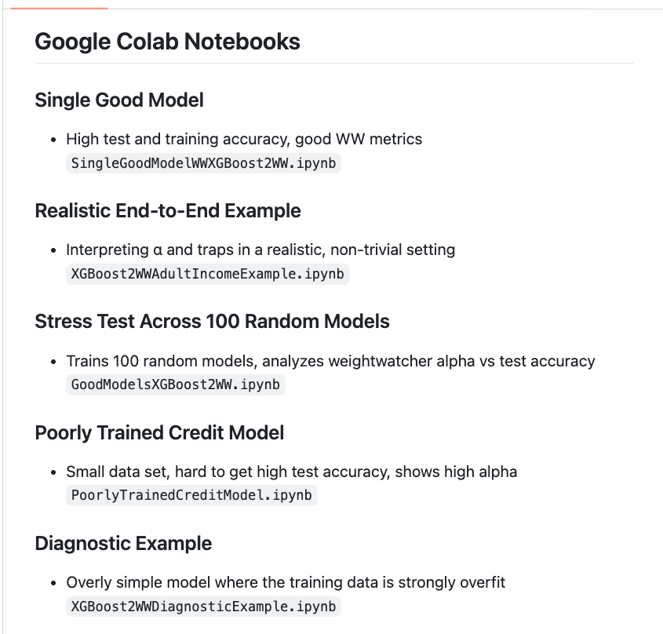

## Why XGBoost2WW?

**XGBoost2WW lets you apply WeightWatcher-style spectral diagnostics to XGBoost models.**

XGBoost models don’t have traditional neural network weight matrices — so you can’t directly run tools like WeightWatcher on them.  
XGBoost2WW bridges that gap by converting a trained XGBoost model into structured matrices (W1/W2/W7/W8) derived from **out-of-fold margin increments along the boosting trajectory**.

These matrices behave like neural weight matrices, so you can analyze them with WeightWatcher.

---

## Why would a production ML engineer care?

Because traditional metrics (accuracy, AUC, logloss) often look fine **right up until a model fails in production**.

Spectral diagnostics can help detect:

- Overfitting that standard validation doesn’t reveal  
- Correlation traps in boosted trees  
- Excessive memorization  
- Unstable training dynamics  
- Data leakage patterns  
- Models that are brittle to distribution shift  

In short:

> XGBoost2WW gives you a structural diagnostic signal — not just a performance metric.

That means you can:
- Compare model candidates beyond accuracy
- Detect problematic models *before deployment*
- Monitor structural drift over time
- Add an extra safety layer to your MLOps pipeline

---

If you deploy XGBoost models in production,  
XGBoost2WW gives you a new lens to inspect them.

# xgboost2ww

Convert XGBoost boosting dynamics into WeightWatcher-style correlation matrices (W1/W2/W7/W8).

## Install

Development install:

```bash
pip install -e .
pip install weightwatcher torch
```

Minimal runtime install:

```bash
pip install xgboost2ww
pip install weightwatcher
```


---

## Google Colab Notebooks

### Single Good Model

- High test and training accuracy, good WW metrics
`SingleGoodModelWWXGBoost2WW.ipynb`


### Realistic End-to-End Example

- Interpreting α and traps in a realistic, non-trivial setting
`XGBoost2WWAdultIncomeExample.ipynb`

### Stress Test Across 100 Random Models

- Trains 100 random models, analyzes weightwatcher alpha vs test accuracy
`GoodModelsXGBoost2WW.ipynb`

### Poorly Trained Credit Model
-  Small data set, hard to get high test accuracy, shows high alpha
`PoorlyTrainedCreditModel.ipynb`

### Diagnostic Example
-  Overly simple model where the training data is strongly overfit
`XGBoost2WWDiagnosticExample.ipynb`


## Quickstart (compute_matrices)

```python
import numpy as np
import xgboost as xgb

from xgboost2ww import compute_matrices

rng = np.random.default_rng(0)
X = rng.normal(size=(300, 12)).astype(np.float32)
logits = 1.5 * X[:, 0] - 0.8 * X[:, 1] + 0.3 * rng.normal(size=300)
y = (logits > 0).astype(np.int32)

dtrain = xgb.DMatrix(X, label=y)

params = {
    "objective": "binary:logistic",
    "eval_metric": "logloss",
    "max_depth": 3,
    "eta": 0.1,
    "subsample": 1.0,
    "colsample_bytree": 1.0,
    "seed": 0,
    "verbosity": 0,
}
rounds = 40
bst = xgb.train(params, dtrain, num_boost_round=rounds)

# Reproducibility knobs for fold training inside compute_matrices / convert
train_params = params
num_boost_round = rounds

mats = compute_matrices(
    bst,
    X,
    y,
    nfolds=5,
    t_points=40,
    random_state=0,
    train_params=train_params,
    num_boost_round=num_boost_round,
)

W7 = mats.W7
print(W7.shape)
```

## Quickstart (convert + WeightWatcher)

```python
import weightwatcher as ww

from xgboost2ww import convert

layer = convert(
    bst,
    X,
    y,
    W="W7",
    return_type="torch",
    nfolds=5,
    t_points=40,
    random_state=0,
    train_params=train_params,
    num_boost_round=num_boost_round,
)

watcher = ww.WeightWatcher(model=layer)
details_df = watcher.analyze(randomize=True, plot=False)

alpha = details_df["alpha"].iloc[0]
rand_num_spikes = details_df["rand_num_spikes"].iloc[0]
print({"alpha": alpha, "rand_num_spikes": rand_num_spikes})
```

For initial evaluation, you do not need `detX=True`. If you want determinant-based diagnostics, you can pass `detX=True`.

## Good XGBoost Models


## Notes / limitations

- Binary classification is the default workflow.
- Multiclass requires setting `multiclass` explicitly (supported modes: `"per_class"`, `"stack"`, `"avg"`).
- `convert(..., multiclass="per_class", return_type="torch")` is unsupported and raises; for multiclass per-class output, use `return_type="numpy"`.
- `torch` is optional unless you need `convert(..., return_type="torch")`.
