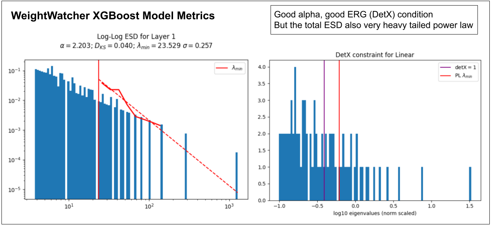

## Why XGBoost2WW?

**XGBoost2WW lets you apply WeightWatcher-style spectral diagnostics to XGBoost models.**

XGBoost models don’t have traditional neural network weight matrices — so you can’t directly run tools like WeightWatcher on them.  
XGBoost2WW bridges that gap by converting a trained XGBoost model into structured matrices (W1/W2/W7/W8/W9) derived from **out-of-fold margin increments along the boosting trajectory**.

These matrices behave like neural weight matrices, so you can analyze them with WeightWatcher.

---

## Why would a production ML engineer care?

Because traditional metrics (accuracy, AUC, logloss) often look fine **right up until a model fails in production**.

Spectral diagnostics can help detect:

- Overfitting that standard validation doesn’t reveal  
- Correlation traps in boosted trees  
- Excessive memorization  
- Unstable training dynamics  
- Data leakage patterns  
- Models that are brittle to distribution shift  

In short:

> XGBoost2WW gives you a structural diagnostic signal — not just a performance metric.

That means you can:
- Compare model candidates beyond accuracy
- Detect problematic models *before deployment*
- Monitor structural drift over time
- Add an extra safety layer to your MLOps pipeline

---

If you deploy XGBoost models in production,  
XGBoost2WW gives you a new lens to inspect them.

# xgboost2ww

Convert XGBoost boosting dynamics into WeightWatcher-style operators (W1/W2/W7/W8/W9/W10).

## Install

Development install:

```bash
pip install -e .
pip install weightwatcher torch
```

Minimal runtime install:

```bash
pip install xgboost2ww
pip install weightwatcher
```


---


## Troubleshooting: `ModuleNotFoundError: No module named "xgboost2ww"`

If `pip show xgboost2ww` says installed but `import xgboost2ww` fails in a notebook, your pip target and notebook kernel are different Python environments.

Use this in a notebook cell:

```python
import sys
print(sys.executable)
!{sys.executable} -m pip show xgboost2ww
```

Then:

1. Install with `%pip install xgboost2ww` (not `!pip`).
2. Restart the runtime/kernel.
3. Re-run the notebook from the top.

In Colab, this mismatch is the most common cause of this error.

---

## Google Colab Notebooks

#### Single Good Model

- High test and training accuracy, good WW metrics
`SingleGoodModelWWXGBoost2WW.ipynb`


#### Realistic End-to-End Example

- Interpreting α and traps in a realistic, non-trivial setting
`XGBoost2WWAdultIncomeExample.ipynb`

#### Stress Test Across 100 Random Models

- Trains 100 random models, analyzes weightwatcher alpha vs test accuracy
`GoodModelsXGBoost2WW.ipynb`

#### Poorly Trained Credit Model
-  Small data set, hard to get high test accuracy, shows high alpha
`PoorlyTrainedCreditModel.ipynb`

#### Diagnostic Example
-  Overly simple model where the training data is strongly overfit
`XGBoost2WWDiagnosticExample.ipynb`

#### SpamBase Alpha=2 Targeted Sweep
- Targeted hyperparameter sweep to maximize validation accuracy near α≈2.0
[`SpamBase_Hyperparameter_Sweep_Alpha2_Targeted.ipynb`](https://colab.research.google.com/github/CalculatedContent/xgboost2ww/blob/main/notebooks/SpamBase_Hyperparameter_Sweep_Alpha2_Targeted.ipynb)

#### Random100 Long-Run Alpha Tracking
- Long-running Random100 catalog training with Google Drive checkpoints and restart/resume support
[`XGBWW_Catalog_Random100_XGBoost_Accuracy_LongRun_AlphaTracking.ipynb`](https://colab.research.google.com/github/CalculatedContent/xgboost2ww/blob/main/notebooks/XGBWW_Catalog_Random100_XGBoost_Accuracy_LongRun_AlphaTracking.ipynb)


## Quickstart (compute_matrices)

```python
import numpy as np
import xgboost as xgb

from xgboost2ww import compute_matrices

rng = np.random.default_rng(0)
X = rng.normal(size=(300, 12)).astype(np.float32)
logits = 1.5 * X[:, 0] - 0.8 * X[:, 1] + 0.3 * rng.normal(size=300)
y = (logits > 0).astype(np.int32)

dtrain = xgb.DMatrix(X, label=y)

params = {
    "objective": "binary:logistic",
    "eval_metric": "logloss",
    "max_depth": 3,
    "eta": 0.1,
    "subsample": 1.0,
    "colsample_bytree": 1.0,
    "seed": 0,
    "verbosity": 0,
}
rounds = 40
bst = xgb.train(params, dtrain, num_boost_round=rounds)

# Reproducibility knobs for fold training inside compute_matrices / convert
train_params = params
num_boost_round = rounds

mats = compute_matrices(
    bst,
    X,
    y,
    nfolds=5,
    t_points=40,
    random_state=0,
    train_params=train_params,
    num_boost_round=num_boost_round,
)

W9 = mats.W9
print(W9.shape)
```

## Quickstart (convert + WeightWatcher)

```python
import weightwatcher as ww

from xgboost2ww import convert

layer = convert(
    bst,
    X,
    y,
    W="W9",
    return_type="torch",
    nfolds=5,
    t_points=40,
    random_state=0,
    train_params=train_params,
    num_boost_round=num_boost_round,
)

watcher = ww.WeightWatcher(model=layer)
details_df = watcher.analyze(randomize=True, plot=False)

alpha = details_df["alpha"].iloc[0]
rand_num_spikes = details_df["rand_num_spikes"].iloc[0]
print({"alpha": alpha, "rand_num_spikes": rand_num_spikes})
```

For initial evaluation, you do not need `detX=True`. If you want determinant-based diagnostics, you can pass `detX=True`.


## What the Diagnostics Look Like

Below is an example of a WeightWatcher spectral analysis applied to an XGBoost model via **xgboost2ww**.

<p align="center">
  
</p>

In this example:
- (Left) The power-law fit produces an α value near 2
- (Right) The ERG detX condition is pretty good (red and purple lines are close)
- (not shown0 No significant traps are detected 

But unlike many Neural Networksm the full empirical spectral density (ESD) shows very-heavy-tailed structure.  This indicates that the training data was very easy to memorize.  That's OK.  Even expected.

This is what a structurally healthy model looks like.

When α drifts upward or traps appear, it is often a signal of:

- Overfitting  
- Correlation traps  
- Memorization  
- Instability in training  
- Data leakage  
- Structural brittleness


## Matrix definitions at a glance

- **W8**: legacy practical surrogate based on weighted/centered `W7`.
- **W9**: canonical regularizer-whitened Fisher OOF trajectory matrix.

For binary classification, with raw OOF increments `dF_oof` and final OOF margin `m_final`:

```text
p = sigmoid(m_final)
h = clip(p * (1 - p), eps, None)
A = weighted_center_cols(dF_oof, h)
gamma_diag[j] = lambda * sum_{trees in endpoint block j}(leaf_value^2)
W9 = diag(sqrt(h)) · A · diag(gamma_diag^{-1/2})
```

`W9` v1 uses the local-quadratic **L2** regularizer mass (`lambda`) and intentionally
ignores the non-smooth **L1** (`alpha`) term.


## W10 (leaf-linearized operator)

`W10` is a new representation family and **not** another OOF trajectory rescaling. Existing W1/W2/W7/W8/W9 behavior is unchanged.

W10 is built from the final fitted booster using:
- final-model leaf assignments,
- Hessian-weighted centering,
- per-tree contrast projection,
- per-tree block whitening.

It is intended to isolate inter-tree correlations after removing trivial leaf-occupancy geometry.

```python
from xgboost2ww import compute_w10, convert

W10 = compute_w10(bst, X, y)
layer = convert(bst, X, y, W="W10", return_type="torch")
```

W10 is currently implemented for `binary:logistic` and `reg:squarederror`. Multiclass W10 is deferred.

W10 is the best-motivated matrix for testing the RG / α≈2 hypothesis, but the package reports the measured alpha honestly and does not assume success.

## Notes / limitations

- Binary classification is the default workflow.
- Multiclass requires setting `multiclass` explicitly (supported modes: `"per_class"`, `"stack"`, `"avg"`).
- `convert(..., multiclass="per_class", return_type="torch")` is unsupported and raises; for multiclass per-class output, use `return_type="numpy"`.
- `torch` is optional unless you need `convert(..., return_type="torch")`.
